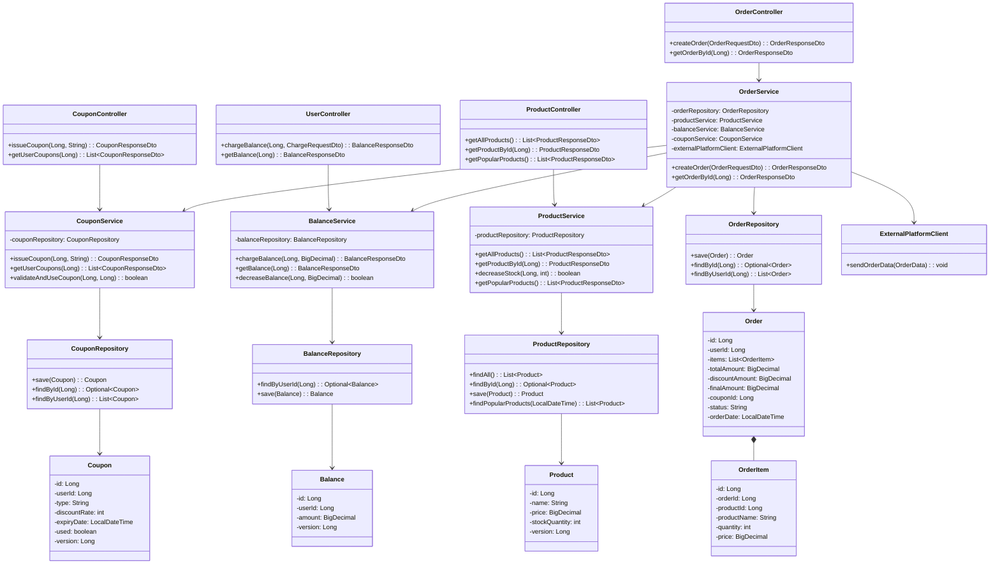

# 클래스 다이어그램

```mermaid
classDiagram
%% 컨트롤러 (API 엔드포인트)
    class OrderController {
        +createOrder(OrderRequestDto): OrderResponseDto
        +getOrderById(Long): OrderResponseDto
    }

    class ProductController {
        +getAllProducts(): List~ProductResponseDto~
        +getProductById(Long): ProductResponseDto
        +getPopularProducts(): List~ProductResponseDto~
    }

    class UserController {
        +chargeBalance(Long, ChargeRequestDto): BalanceResponseDto
        +getBalance(Long): BalanceResponseDto
    }

    class CouponController {
        +issueCoupon(Long, String): CouponResponseDto
        +getUserCoupons(Long): List~CouponResponseDto~
    }

%% 서비스 (비즈니스 로직)
    class OrderService {
        -orderRepository: OrderRepository
        -productService: ProductService
        -balanceService: BalanceService
        -couponService: CouponService
        -externalPlatformClient: ExternalPlatformClient
        +createOrder(OrderRequestDto): OrderResponseDto
        +getOrderById(Long): OrderResponseDto
    }

    class ProductService {
        -productRepository: ProductRepository
        +getAllProducts(): List~ProductResponseDto~
        +getProductById(Long): ProductResponseDto
        +decreaseStock(Long, int): boolean
        +getPopularProducts(): List~ProductResponseDto~
    }

    class BalanceService {
        -balanceRepository: BalanceRepository
        +chargeBalance(Long, BigDecimal): BalanceResponseDto
        +getBalance(Long): BalanceResponseDto
        +decreaseBalance(Long, BigDecimal): boolean
    }

    class CouponService {
        -couponRepository: CouponRepository
        +issueCoupon(Long, String): CouponResponseDto
        +getUserCoupons(Long): List~CouponResponseDto~
        +validateAndUseCoupon(Long, Long): boolean
    }

%% 도메인 모델 (핵심 엔티티)
    class Order {
        -id: Long
        -userId: Long
        -items: List~OrderItem~
        -totalAmount: BigDecimal
        -discountAmount: BigDecimal
        -finalAmount: BigDecimal
        -couponId: Long
        -status: String
        -orderDate: LocalDateTime
    }

    class Product {
        -id: Long
        -name: String
        -price: BigDecimal
        -stockQuantity: int
        -version: Long
    }

    class Balance {
        -id: Long
        -userId: Long
        -amount: BigDecimal
        -version: Long
    }

    class Coupon {
        -id: Long
        -userId: Long
        -type: String
        -discountRate: int
        -expiryDate: LocalDateTime
        -used: boolean
        -version: Long
    }

    class OrderItem {
        -id: Long
        -orderId: Long
        -productId: Long
        -productName: String
        -quantity: int
        -price: BigDecimal
    }

%% 리포지토리 (데이터 액세스)
    class OrderRepository {
        +save(Order): Order
        +findById(Long): Optional~Order~
        +findByUserId(Long): List~Order~
    }

    class ProductRepository {
        +findAll(): List~Product~
        +findById(Long): Optional~Product~
        +save(Product): Product
        +findPopularProducts(LocalDateTime): List~Product~
    }

    class BalanceRepository {
        +findByUserId(Long): Optional~Balance~
        +save(Balance): Balance
    }

    class CouponRepository {
        +save(Coupon): Coupon
        +findById(Long): Optional~Coupon~
        +findByUserId(Long): List~Coupon~
    }

%% 외부 시스템 연동
    class ExternalPlatformClient {
        +sendOrderData(OrderData): void
    }

%% 관계 정의
    OrderController --> OrderService
    ProductController --> ProductService
    UserController --> BalanceService
    CouponController --> CouponService

    OrderService --> OrderRepository
    OrderService --> ProductService
    OrderService --> BalanceService
    OrderService --> CouponService
    OrderService --> ExternalPlatformClient

    ProductService --> ProductRepository
    BalanceService --> BalanceRepository
    CouponService --> CouponRepository

    OrderRepository --> Order
    ProductRepository --> Product
    BalanceRepository --> Balance
    CouponRepository --> Coupon

    Order *-- OrderItem
```