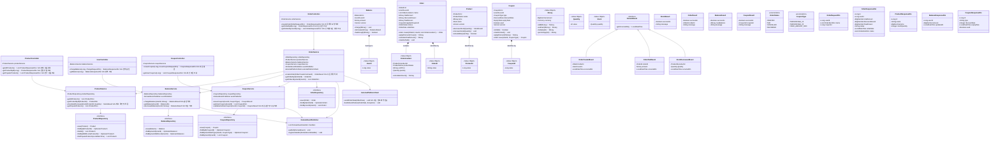

# 클래스 다이어그램

```mermaid
classDiagram
%% 프레젠테이션 계층 (Controller) - HTTP 요청 진입점
    class OrderController {
        -OrderService orderService
        +createOrder(OrderRequestDto): OrderResponseDto %% 주문 생성 요청 처리
        +getOrderById(Long): OrderResponseDto %% 주문 단건 조회
        +getOrdersByUserId(Long): List~OrderResponseDto~ %% 유저별 주문 목록 조회
    }

    class ProductController {
        -ProductService productService
        +getAllProducts(): List~ProductResponseDto~ %% 전체 상품 목록
        +getProductById(Long): ProductResponseDto %% 단일 상품 조회
        +getPopularProducts(): List~ProductResponseDto~ %% 인기 상품 조회
    }

    class UserController {
        -BalanceService balanceService
        +chargeBalance(Long, ChargeRequestDto): BalanceResponseDto %% 잔액 충전
        +getBalance(Long): BalanceResponseDto %% 잔액 조회
    }

    class CouponController {
        -CouponService couponService
        +issueCoupon(Long, IssueCouponRequestDto): CouponResponseDto %% 쿠폰 발급
        +getUserCoupons(Long): List~CouponResponseDto~ %% 보유 쿠폰 조회
    }

%% 응용 서비스 계층 - 유스케이스 담당, 도메인 로직은 위임
    class OrderService {
        -OrderRepository orderRepository
        -ProductService productService
        -BalanceService balanceService
        -CouponService couponService
        -DomainEventPublisher eventPublisher
        -ExternalPlatformClient externalPlatformClient
        +createOrder(OrderCreateCommand): OrderResult %% 주문 생성 처리
        +getOrderById(OrderId): OrderDto
        +getOrdersByUserId(UserId): List~OrderDto~
    }

    class ProductService {
        -ProductRepository productRepository
        +getAllProducts(): List~ProductDto~
        +getProductById(ProductId): ProductDto
        +checkAndDecreaseStock(ProductId, Quantity): StockResult %% 재고 확인 및 차감
        +getPopularProducts(): List~ProductDto~
    }

    class BalanceService {
        -BalanceRepository balanceRepository
        -DomainEventPublisher eventPublisher
        +chargeBalance(UserId, Money): BalanceResult %% 충전 처리
        +getBalance(UserId): BalanceDto
        +decreaseBalance(UserId, Money): BalanceResult %% 차감 처리
    }

    class CouponService {
        -CouponRepository couponRepository
        -DomainEventPublisher eventPublisher
        +issueCoupon(UserId, CouponType): CouponResult
        +getUserCoupons(UserId): List~CouponDto~
        +validateAndUseCoupon(UserId, CouponId): CouponResult %% 쿠폰 검증 및 사용 처리
    }

%% 도메인 이벤트 발행 메커니즘
    class DomainEventPublisher {
        -List~DomainEventHandler~ handlers
        +publish(DomainEvent): void
        +registerHandler(DomainEventHandler): void
    }

%% 외부 시스템 연동
    class ExternalPlatformClient {
        +sendOrderData(OrderData): void %% 주문 정보 외부 전송
        -handleSendFailure(OrderData, Exception): void
    }

%% 도메인 계층 (Entity, ValueObject 포함)
    class Order {
        -OrderId id
        -UserId userId
        -List~OrderLineItem~ items
        -Money totalAmount
        -Money discountAmount
        -Money finalAmount
        -CouponId appliedCouponId
        -OrderStatus status
        -OrderDate orderDate
        +static create(OrderId, UserId, List~OrderLineItem~): Order
        +applyDiscount(Coupon): Money
        +calculateTotalAmount(): Money
        +markAsPaid(): void
    }

    class Product {
        -ProductId id
        -ProductName name
        -Money price
        -Stock stock
        -Version version
        +decreaseStock(Quantity): StockResult
        +increaseStock(Quantity): void
        +isAvailable(Quantity): boolean
    }

    class Balance {
        -BalanceId id
        -UserId userId
        -Money amount
        -Version version
        +charge(Money): void
        +decrease(Money): BalanceResult
        +hasEnough(Money): boolean
    }

    class Coupon {
        -CouponId id
        -UserId userId
        -CouponType type
        -DiscountRate discountRate
        -ExpiryDate expiryDate
        -boolean used
        -Version version
        +isValid(): boolean
        +markAsUsed(): void
        +applyDiscount(Money): Money
        +static issue(UserId, CouponType): Coupon
    }

%% 값 객체
    class OrderId {
<<Value Object>>
-String value
}
class UserId {
<<Value Object>>
-Long value
}
class ProductId {
<<Value Object>>
-Long value
}
class CouponId {
<<Value Object>>
-Long value
}
class Money {
<<Value Object>>
-BigDecimal amount
-Currency currency
+add(Money): Money
+subtract(Money): Money
+multiply(int): Money
+percentage(int): Money
}
class Quantity {
<<Value Object>>
-int value
}
class Stock {
<<Value Object>>
-Quantity quantity
}
class OrderLineItem {
<<Value Object>>
-ProductId productId
-ProductName productName
-Money unitPrice
-Quantity quantity
+calculateAmount(): Money
}

%% 도메인 이벤트 정의
class DomainEvent {
<<Interface>>
+getOccurredOn(): LocalDateTime
}
class OrderCreatedEvent {
-OrderId orderId
-UserId userId
-LocalDateTime occurredOn
}
class OrderPaidEvent {
-OrderId orderId
-Money amount
-LocalDateTime occurredOn
}
class StockDecreasedEvent {
-ProductId productId
-Quantity quantity
-LocalDateTime occurredOn
}

%% 결과 객체
class StockResult {
+boolean successful
+String message
}
class OrderResult {
+boolean successful
+OrderId orderId
+String message
}
class BalanceResult {
+boolean successful
+Money newBalance
+String message
}
class CouponResult {
+boolean successful
+CouponId couponId
+String message
}

%% 열거형
class OrderStatus {
<<enumeration>>
CREATED
PAID
CANCELLED
DELIVERED
}
class CouponType {
<<enumeration>>
PERCENTAGE_10
PERCENTAGE_20
FIXED_AMOUNT_5000
    }

%% 데이터 액세스 계층
class OrderRepository {
<<Interface>>
+save(Order): Order
+findById(OrderId): Optional~Order~
+findByUserId(UserId): List~Order~
}
class ProductRepository {
<<Interface>>
+save(Product): Product
+findById(ProductId): Optional~Product~
+findAll(): List~Product~
+findByIdWithLock(ProductId): Optional~Product~
+findPopularProducts(LocalDateTime): List~Product~
}
class BalanceRepository {
<<Interface>>
+save(Balance): Balance
+findByUserId(UserId): Optional~Balance~
+findByUserIdWithLock(UserId): Optional~Balance~
}
class CouponRepository {
<<Interface>>
+save(Coupon): Coupon
+findById(CouponId): Optional~Coupon~
+findByUserIdAndType(UserId, CouponType): Optional~Coupon~
+findByUserId(UserId): List~Coupon~
}

%% DTO 객체들
class OrderRequestDto {
+Long userId
+List~OrderItemDto~ items
+Long couponId
}
class OrderResponseDto {
+Long id
+Long userId
+BigDecimal totalAmount
+BigDecimal discountAmount
+BigDecimal finalAmount
+String status
+LocalDateTime orderDate
+List~OrderItemDto~ items
}
class ProductResponseDto {
+Long id
+String name
+BigDecimal price
+Integer stockQuantity
}
class BalanceResponseDto {
+Long userId
+BigDecimal amount
+LocalDateTime updatedAt
}
class CouponResponseDto {
+Long id
+String type
+Integer discountRate
+LocalDateTime expiryDate
+Boolean used
    }

%% 관계 정의
OrderController --> OrderService
ProductController --> ProductService
UserController --> BalanceService
CouponController --> CouponService
OrderService --> ProductService
OrderService --> BalanceService
OrderService --> CouponService
OrderService --> OrderRepository
ProductService --> ProductRepository
BalanceService --> BalanceRepository
CouponService --> CouponRepository
OrderService --> DomainEventPublisher
BalanceService --> DomainEventPublisher
CouponService --> DomainEventPublisher
OrderService --> ExternalPlatformClient
Order *-- OrderLineItem : contains
Order *-- OrderId : identifies by
Product *-- ProductId : identifies by
Balance *-- UserId : belongs to
Coupon *-- CouponId : identifies by
DomainEvent <|-- OrderCreatedEvent
DomainEvent <|-- OrderPaidEvent
DomainEvent <|-- StockDecreasedEvent
```