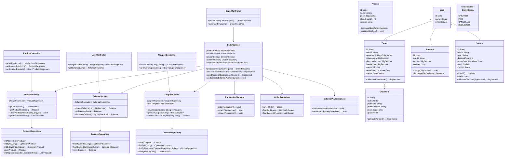

# 클래스 다이어그램

```mermaid
classDiagram
    %% 컨트롤러 계층
    class OrderController {
        +createOrder(OrderRequest): OrderResponse
        +getOrderById(Long): OrderResponse
    }
    
    class ProductController {
        +getAllProducts(): List~ProductResponse~
        +getProductById(Long): ProductResponse
        +getPopularProducts(): List~ProductResponse~
    }
    
    class UserController {
        +chargeBalance(Long, ChargeRequest): BalanceResponse
        +getBalance(Long): BalanceResponse
    }
    
    class CouponController {
        +issueCoupon(Long, String): CouponResponse
        +getUserCoupons(Long): List~CouponResponse~
    }
    
    %% 서비스 계층
    class OrderService {
        -productService: ProductService
        -balanceService: BalanceService
        -couponService: CouponService
        -orderRepository: OrderRepository
        -externalPlatformClient: ExternalPlatformClient
        +processOrder(OrderRequest): OrderResponse
        -calculateTotalAmount(List~OrderItem~): BigDecimal
        -applyDiscount(BigDecimal, Coupon): BigDecimal
        -sendOrderToExternalPlatform(Order): void
    }
    
    class ProductService {
        -productRepository: ProductRepository
        +getAllProducts(): List~Product~
        +getProductById(Long): Product
        +checkAndDecreaseStock(Long, int): void
        +getPopularProducts(): List~Product~
    }
    
    class BalanceService {
        -balanceRepository: BalanceRepository
        +chargeBalance(Long, BigDecimal): Balance
        +getBalance(Long): Balance
        +decreaseBalance(Long, BigDecimal): Balance
    }
    
    class CouponService {
        -couponRepository: CouponRepository
        -redisTemplate: RedisTemplate
        +issueCoupon(Long, String): Coupon
        +getUserCoupons(Long): List~Coupon~
        +validateAndUseCoupon(Long, Long): Coupon
    }
    
    class TransactionManager {
        +beginTransaction(): void
        +commitTransaction(): void
        +rollbackTransaction(): void
    }
    
    %% 리포지토리 계층
    class OrderRepository {
        +save(Order): Order
        +findById(Long): Optional~Order~
        +findByUserId(Long): List~Order~
    }
    
    class ProductRepository {
        +findAll(): List~Product~
        +findById(Long): Optional~Product~
        +findByIdWithLock(Long): Optional~Product~
        +save(Product): Product
        +findPopularProducts(LocalDateTime): List~Product~
    }
    
    class BalanceRepository {
        +findByUserId(Long): Optional~Balance~
        +findByUserIdWithLock(Long): Optional~Balance~
        +save(Balance): Balance
    }
    
    class CouponRepository {
        +save(Coupon): Coupon
        +findById(Long): Optional~Coupon~
        +findByUserIdAndCouponType(Long, String): Optional~Coupon~
        +findByUserId(Long): List~Coupon~
    }
    
    %% 외부 시스템 연동
    class ExternalPlatformClient {
        +sendOrderData(OrderData): void
        -handleSendFailure(OrderData): void
    }
    
    %% 도메인 모델
    class Order {
        -id: Long
        -userId: Long
        -orderItems: List~OrderItem~
        -totalAmount: BigDecimal
        -discountAmount: BigDecimal
        -finalAmount: BigDecimal
        -couponId: Long
        -orderDate: LocalDateTime
        -status: OrderStatus
        +calculateTotalAmount(): BigDecimal
    }
    
    class OrderItem {
        -id: Long
        -order: Order
        -productId: Long
        -productName: String
        -price: BigDecimal
        -quantity: int
        +calculateAmount(): BigDecimal
    }
    
    class Product {
        -id: Long
        -name: String
        -price: BigDecimal
        -stockQuantity: int
        -version: Long
        +decreaseStock(int): boolean
        +increaseStock(int): void
    }
    
    class User {
        -id: Long
        -name: String
        -email: String
    }
    
    class Balance {
        -id: Long
        -userId: Long
        -amount: BigDecimal
        -version: Long
        +charge(BigDecimal): void
        +decrease(BigDecimal): boolean
    }
    
    class Coupon {
        -id: Long
        -userId: Long
        -type: String
        -discountRate: int
        -expiryDate: LocalDateTime
        -used: boolean
        -version: Long
        +isValid(): boolean
        +use(): void
        +calculateDiscount(BigDecimal): BigDecimal
    }
    
    %% 열거형 및 유틸리티
    class OrderStatus {
        <<enumeration>>
        CREATED
        PAID
        CANCELLED
        DELIVERED
    }
    
    %% 연관 관계
    OrderController --> OrderService
    ProductController --> ProductService
    UserController --> BalanceService
    CouponController --> CouponService
    
    OrderService --> ProductService
    OrderService --> BalanceService
    OrderService --> CouponService
    OrderService --> OrderRepository
    OrderService --> ExternalPlatformClient
    OrderService --> TransactionManager
    
    ProductService --> ProductRepository
    BalanceService --> BalanceRepository
    CouponService --> CouponRepository
    
    Order o--> "*" OrderItem
    User "1" -- "1" Balance
    User "1" -- "*" Coupon
    User "1" -- "*" Order
```