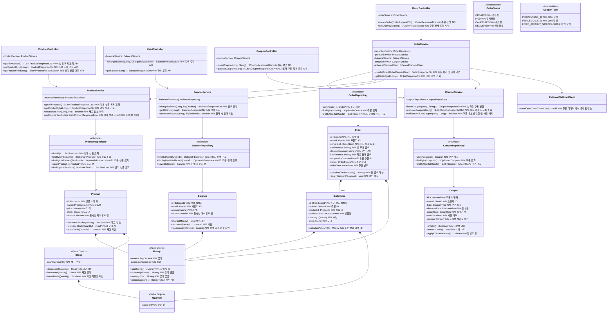

# 클래스 다이어그램

```mermaid
classDiagram
%% 프레젠테이션 계층 (컨트롤러)
    class OrderController {
        -orderService: OrderService
        +createOrder(OrderRequestDto): OrderResponseDto  %% 주문 생성 API
        +getOrderById(Long): OrderResponseDto  %% 주문 상세 조회 API
    }

    class ProductController {
        -productService: ProductService
        +getAllProducts(): List~ProductResponseDto~  %% 상품 목록 조회 API
        +getProductById(Long): ProductResponseDto  %% 상품 상세 조회 API
        +getPopularProducts(): List~ProductResponseDto~  %% 인기 상품 조회 API
    }

    class UserController {
        -balanceService: BalanceService
        +chargeBalance(Long, ChargeRequestDto): BalanceResponseDto  %% 잔액 충전 API
        +getBalance(Long): BalanceResponseDto  %% 잔액 조회 API
    }

    class CouponController {
        -couponService: CouponService
        +issueCoupon(Long, String): CouponResponseDto  %% 쿠폰 발급 API
        +getUserCoupons(Long): List~CouponResponseDto~  %% 사용자 쿠폰 목록 조회 API
    }

%% 애플리케이션 계층 (서비스)
    class OrderService {
        -orderRepository: OrderRepository
        -productService: ProductService
        -balanceService: BalanceService
        -couponService: CouponService
        -externalPlatformClient: ExternalPlatformClient
        +createOrder(OrderRequestDto): OrderResponseDto  %% 주문 처리 및 결제 수행
        +getOrderById(Long): OrderResponseDto  %% 주문 정보 조회
    }

    class ProductService {
        -productRepository: ProductRepository
        +getAllProducts(): List~ProductResponseDto~  %% 전체 상품 목록 조회
        +getProductById(Long): ProductResponseDto  %% 단일 상품 조회
        +decreaseStock(Long, int): boolean  %% 재고 감소 처리
        +getPopularProducts(): List~ProductResponseDto~  %% 인기 상품 조회 (3일 내 판매량 기준)
    }

    class BalanceService {
        -balanceRepository: BalanceRepository
        +chargeBalance(Long, BigDecimal): BalanceResponseDto  %% 잔액 충전
        +getBalance(Long): BalanceResponseDto  %% 잔액 조회
        +decreaseBalance(Long, BigDecimal): boolean  %% 결제 시 잔액 차감
    }

    class CouponService {
        -couponRepository: CouponRepository
        +issueCoupon(Long, String): CouponResponseDto  %% 선착순 쿠폰 발급
        +getUserCoupons(Long): List~CouponResponseDto~  %% 사용자 쿠폰 목록 조회
        +validateAndUseCoupon(Long, Long): boolean  %% 쿠폰 유효성 검증 및 사용 처리
    }

%% 도메인 모델 (엔티티)
    class Order {
        -id: OrderId  %% 주문 식별자
        -userId: UserId  %% 주문자 ID
        -items: List~OrderItem~  %% 주문 상품 목록
        -totalAmount: Money  %% 총 주문 금액
        -discountAmount: Money  %% 할인 금액
        -finalAmount: Money  %% 최종 결제 금액
        -couponId: CouponId  %% 적용된 쿠폰 ID
        -status: OrderStatus  %% 주문 상태
        -orderDate: OrderDate  %% 주문 날짜
        +calculateTotalAmount(): Money  %% 총 금액 계산
        +applyDiscount(Coupon): void  %% 할인 적용
    }

    class Product {
        -id: ProductId  %% 상품 식별자
        -name: ProductName  %% 상품명
        -price: Money  %% 가격
        -stock: Stock  %% 재고
        -version: Version  %% 동시성 제어용 버전
        +decreaseStock(Quantity): boolean  %% 재고 감소
        +increaseStock(Quantity): void  %% 재고 증가
        +isAvailable(Quantity): boolean  %% 재고 확인
    }

    class Balance {
        -id: BalanceId  %% 잔액 식별자
        -userId: UserId  %% 사용자 ID
        -amount: Money  %% 잔액
        -version: Version  %% 동시성 제어용 버전
        +charge(Money): void  %% 충전
        +decrease(Money): boolean  %% 차감
        +hasEnough(Money): boolean  %% 잔액 충분 여부 확인
    }

    class Coupon {
        -id: CouponId  %% 쿠폰 식별자
        -userId: UserId  %% 소유자 ID
        -type: CouponType  %% 쿠폰 유형
        -discountRate: DiscountRate  %% 할인율
        -expiryDate: ExpiryDate  %% 유효기간
        -used: boolean  %% 사용 여부
        -version: Version  %% 동시성 제어용 버전
        +isValid(): boolean  %% 유효성 검증
        +markAsUsed(): void  %% 사용 처리
        +applyDiscount(Money): Money  %% 할인 적용
    }

    class OrderItem {
        -id: OrderItemId  %% 주문 상품 식별자
        -orderId: OrderId  %% 주문 ID
        -productId: ProductId  %% 상품 ID
        -productName: ProductName  %% 상품명
        -quantity: Quantity  %% 수량
        -price: Money  %% 가격
        +calculateAmount(): Money  %% 주문 상품 금액 계산
    }

%% 값 객체 (Value Objects)
    class Money {
<<Value Object>>
-amount: BigDecimal  %% 금액
-currency: Currency  %% 통화
+add(Money): Money  %% 금액 덧셈
+subtract(Money): Money  %% 금액 뺄셈
+multiply(int): Money  %% 금액 곱셈
+percentage(int): Money  %% 퍼센트 계산
}

class Quantity {
<<Value Object>>
-value: int  %% 수량 값
}

class Stock {
<<Value Object>>
-quantity: Quantity  %% 재고 수량
+decrease(Quantity): Stock  %% 재고 감소
+increase(Quantity): Stock  %% 재고 증가
+isAvailable(Quantity): boolean  %% 재고 가용성 확인
}

%% 리포지토리 (인터페이스)
class OrderRepository {
<<interface>>
+save(Order): Order  %% 주문 저장
+findById(OrderId): Optional~Order~  %% 주문 조회
+findByUserId(UserId): List~Order~  %% 사용자별 주문 조회
}

class ProductRepository {
<<interface>>
+findAll(): List~Product~  %% 전체 상품 조회
+findById(ProductId): Optional~Product~  %% 상품 조회
+findByIdWithLock(ProductId): Optional~Product~  %% 락 적용 상품 조회
+save(Product): Product  %% 상품 저장
+findPopularProducts(LocalDateTime): List~Product~  %% 인기 상품 조회
}

class BalanceRepository {
<<interface>>
+findByUserId(UserId): Optional~Balance~  %% 사용자 잔액 조회
+findByUserIdWithLock(UserId): Optional~Balance~  %% 락 적용 잔액 조회
+save(Balance): Balance  %% 잔액 정보 저장
}

class CouponRepository {
<<interface>>
+save(Coupon): Coupon  %% 쿠폰 저장
+findById(CouponId): Optional~Coupon~  %% 쿠폰 조회
+findByUserId(UserId): List~Coupon~  %% 사용자별 쿠폰 조회
}

%% 외부 시스템 연동
class ExternalPlatformClient {
+sendOrderData(OrderData): void  %% 주문 데이터 외부 플랫폼 전송
}

%% 열거형
class OrderStatus {
<<enumeration>>
CREATED  %% 생성됨
PAID  %% 결제완료
CANCELLED  %% 취소됨
DELIVERED  %% 배송완료
    }

class CouponType {
<<enumeration>>
PERCENTAGE_10  %% 10% 할인
PERCENTAGE_20  %% 20% 할인
FIXED_AMOUNT_5000  %% 5000원 정액 할인
    }

%% 관계 정의
OrderController --> OrderService
ProductController --> ProductService
UserController --> BalanceService
CouponController --> CouponService

OrderService --> OrderRepository
OrderService --> ProductService
OrderService --> BalanceService
OrderService --> CouponService
OrderService --> ExternalPlatformClient

ProductService --> ProductRepository
BalanceService --> BalanceRepository
CouponService --> CouponRepository

OrderRepository --> Order
ProductRepository --> Product
BalanceRepository --> Balance
CouponRepository --> Coupon

Order *-- "many" OrderItem

%% 값 객체와 엔티티 관계
Order *-- Money
Product *-- Money
Product *-- Stock
Balance *-- Money
OrderItem *-- Money
OrderItem *-- Quantity
Stock *-- Quantity
```