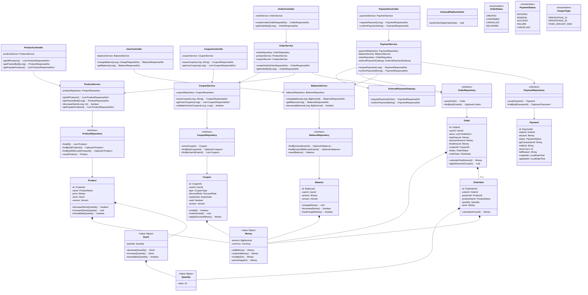

# 클래스 다이어그램

```mermaid
classDiagram
%% 프레젠테이션 계층 (컨트롤러)
    class OrderController {
        -orderService: OrderService
        +createOrder(OrderRequestDto): OrderResponseDto
        +getOrderById(Long): OrderResponseDto
    }

    class ProductController {
        -productService: ProductService
        +getAllProducts(): List~ProductResponseDto~
        +getProductById(Long): ProductResponseDto
        +getPopularProducts(): List~ProductResponseDto~
    }

    class UserController {
        -balanceService: BalanceService
        +chargeBalance(Long, ChargeRequestDto): BalanceResponseDto
        +getBalance(Long): BalanceResponseDto
    }

    class CouponController {
        -couponService: CouponService
        +issueCoupon(Long, String): CouponResponseDto
        +getUserCoupons(Long): List~CouponResponseDto~
    }

    class PaymentController {
        -paymentService: PaymentService
        +requestPayment(Long): PaymentResponseDto
        +confirmPayment(String): PaymentResponseDto
    }

%% 애플리케이션 계층 (서비스)
    class OrderService {
        -orderRepository: OrderRepository
        -productService: ProductService
        -couponService: CouponService
        +createOrder(OrderRequestDto): OrderResponseDto
        +getOrderById(Long): OrderResponseDto
    }

    class PaymentService {
        -paymentRepository: PaymentRepository
        -balanceService: BalanceService
        -orderRepository: OrderRepository
        -externalPaymentGateway: ExternalPaymentGateway
        +requestPayment(Long): PaymentResponseDto
        +confirmPayment(String): PaymentResponseDto
    }

    class ProductService {
        -productRepository: ProductRepository
        +getAllProducts(): List~ProductResponseDto~
        +getProductById(Long): ProductResponseDto
        +decreaseStock(Long, int): boolean
        +getPopularProducts(): List~ProductResponseDto~
    }

    class BalanceService {
        -balanceRepository: BalanceRepository
        +chargeBalance(Long, BigDecimal): BalanceResponseDto
        +getBalance(Long): BalanceResponseDto
        +decreaseBalance(Long, BigDecimal): boolean
    }

    class CouponService {
        -couponRepository: CouponRepository
        +issueCoupon(Long, String): CouponResponseDto
        +getUserCoupons(Long): List~CouponResponseDto~
        +validateAndUseCoupon(Long, Long): boolean
    }

%% 도메인 모델 (엔티티)
    class Order {
        -id: OrderId
        -userId: UserId
        -items: List~OrderItem~
        -totalAmount: Money
        -discountAmount: Money
        -finalAmount: Money
        -couponId: CouponId
        -status: OrderStatus
        -orderDate: OrderDate
        +calculateTotalAmount(): Money
        +applyDiscount(Coupon): void
    }

    class Payment {
        -id: PaymentId
        -orderId: OrderId
        -amount: Money
        -status: PaymentStatus
        -pgTransactionId: String
        -method: String
        -retryCount: int
        -failReason: String
        -createdAt: LocalDateTime
        -updatedAt: LocalDateTime
    }

    class Product {
        -id: ProductId
        -name: ProductName
        -price: Money
        -stock: Stock
        -version: Version
        +decreaseStock(Quantity): boolean
        +increaseStock(Quantity): void
        +isAvailable(Quantity): boolean
    }

    class Balance {
        -id: BalanceId
        -userId: UserId
        -amount: Money
        -version: Version
        +charge(Money): void
        +decrease(Money): boolean
        +hasEnough(Money): boolean
    }

    class Coupon {
        -id: CouponId
        -userId: UserId
        -type: CouponType
        -discountRate: DiscountRate
        -expiryDate: ExpiryDate
        -used: boolean
        -version: Version
        +isValid(): boolean
        +markAsUsed(): void
        +applyDiscount(Money): Money
    }

    class OrderItem {
        -id: OrderItemId
        -orderId: OrderId
        -productId: ProductId
        -productName: ProductName
        -quantity: Quantity
        -price: Money
        +calculateAmount(): Money
    }

%% 값 객체
    class Money {
<<Value Object>>
-amount: BigDecimal
-currency: Currency
+add(Money): Money
+subtract(Money): Money
+multiply(int): Money
+percentage(int): Money
}

class Quantity {
<<Value Object>>
-value: int
    }

class Stock {
<<Value Object>>
-quantity: Quantity
+decrease(Quantity): Stock
+increase(Quantity): Stock
+isAvailable(Quantity): boolean
}

%% 리포지토리
class OrderRepository {
<<interface>>
+save(Order): Order
+findById(OrderId): Optional~Order~
}

class PaymentRepository {
<<interface>>
+save(Payment): Payment
+findById(PaymentId): Optional~Payment~
}

class ProductRepository {
<<interface>>
+findAll(): List~Product~
+findById(ProductId): Optional~Product~
+findByIdWithLock(ProductId): Optional~Product~
+save(Product): Product
}

class BalanceRepository {
<<interface>>
+findByUserId(UserId): Optional~Balance~
+findByUserIdWithLock(UserId): Optional~Balance~
+save(Balance): Balance
}

class CouponRepository {
<<interface>>
+save(Coupon): Coupon
+findById(CouponId): Optional~Coupon~
+findByUserId(UserId): List~Coupon~
}

%% 외부 시스템 연동
class ExternalPlatformClient {
+sendOrderData(OrderData): void
}

class ExternalPaymentGateway {
+requestPayment(Order): PaymentResponseDto
+confirmPayment(String): PaymentResponseDto
}

%% 열거형
class OrderStatus {
<<enumeration>>
CREATED
CONFIRMED
CANCELLED
DELIVERED
}

class PaymentStatus {
<<enumeration>>
INITIATED
PENDING
SUCCESS
FAILURE
CANCELLED
}

class CouponType {
<<enumeration>>
PERCENTAGE_10
PERCENTAGE_20
FIXED_AMOUNT_5000
    }

%% 관계 정의
OrderController --> OrderService
ProductController --> ProductService
UserController --> BalanceService
CouponController --> CouponService
PaymentController --> PaymentService

OrderService --> OrderRepository
OrderService --> ProductService
OrderService --> CouponService

PaymentService --> PaymentRepository
PaymentService --> BalanceService
PaymentService --> OrderRepository
PaymentService --> ExternalPaymentGateway

ProductService --> ProductRepository
BalanceService --> BalanceRepository
CouponService --> CouponRepository

OrderRepository --> Order
PaymentRepository --> Payment
ProductRepository --> Product
BalanceRepository --> Balance
CouponRepository --> Coupon

Order *-- "many" OrderItem
Order *-- Money
OrderItem *-- Money
OrderItem *-- Quantity
Product *-- Stock
Product *-- Money
Stock *-- Quantity
Balance *-- Money
Coupon *-- Money
```
