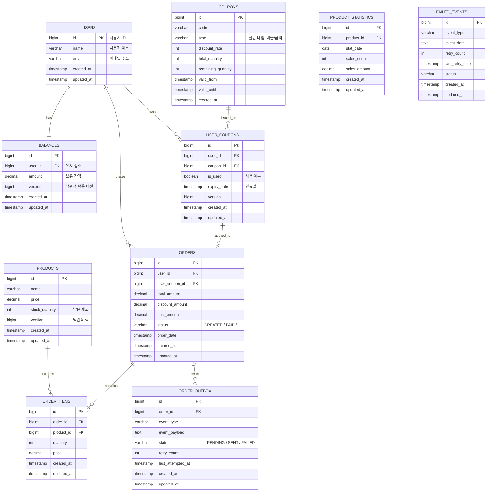

# E-R 다이어그램

```mermaid
erDiagram
    USERS ||--o{ ORDERS : places
    USERS ||--|| BALANCES : has
    USERS ||--o{ USER_COUPONS : owns
    PRODUCTS ||--o{ ORDER_ITEMS : includes
    ORDERS ||--o{ ORDER_ITEMS : contains
    COUPONS ||--o{ USER_COUPONS : issued_as
    USER_COUPONS ||--o| ORDERS : applied_to
    ORDERS ||--o{ ORDER_OUTBOX : emits

    USERS {
        bigint id PK  "사용자 ID"
        varchar name  "사용자 이름"
        varchar email "이메일 주소"
        timestamp created_at
        timestamp updated_at
    }

    BALANCES {
        bigint id PK
        bigint user_id FK "유저 참조"
        decimal amount    "보유 잔액"
        bigint version    "낙관적 락용 버전"
        timestamp created_at
        timestamp updated_at
    }

    PRODUCTS {
        bigint id PK
        varchar name
        decimal price
        int stock_quantity "남은 재고"
        bigint version     "낙관적 락"
        timestamp created_at
        timestamp updated_at
    }

    COUPONS {
        bigint id PK
        varchar code
        varchar type          "할인 타입: 비율/금액"
        int discount_rate
        int total_quantity
        int remaining_quantity
        timestamp valid_from
        timestamp valid_until
        timestamp created_at
    }

    USER_COUPONS {
        bigint id PK
        bigint user_id FK
        bigint coupon_id FK
        boolean is_used        "사용 여부"
        timestamp expiry_date  "만료일"
        bigint version
        timestamp created_at
        timestamp updated_at
    }

    ORDERS {
        bigint id PK
        bigint user_id FK
        bigint user_coupon_id FK
        decimal total_amount
        decimal discount_amount
        decimal final_amount
        varchar status         "CREATED / PAID / ..."
        timestamp order_date
        timestamp created_at
        timestamp updated_at
    }

    ORDER_ITEMS {
        bigint id PK
        bigint order_id FK
        bigint product_id FK
        int quantity
        decimal price
        timestamp created_at
        timestamp updated_at
    }

    PRODUCT_STATISTICS {
        bigint id PK
        bigint product_id FK
        date stat_date
        int sales_count
        decimal sales_amount
        timestamp created_at
        timestamp updated_at
    }

    ORDER_OUTBOX {
        bigint id PK
        bigint order_id FK
        varchar event_type
        text event_payload
        varchar status       "PENDING / SENT / FAILED"
        int retry_count
        timestamp last_attempted_at
        timestamp created_at
        timestamp updated_at
    }

    FAILED_EVENTS {
        bigint id PK
        varchar event_type
        text event_data
        int retry_count
        timestamp last_retry_time
        varchar status
        timestamp created_at
        timestamp updated_at
    }
```