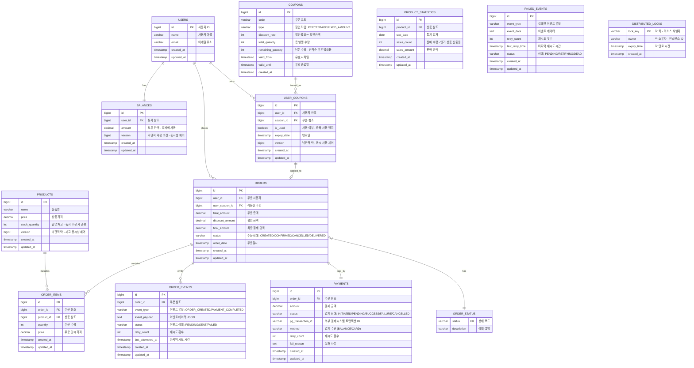

# E-R 다이어그램

```mermaid
erDiagram
    USERS ||--o{ ORDERS : places
    USERS ||--|| BALANCES : has
    USERS ||--o{ USER_COUPONS : owns
    PRODUCTS ||--o{ ORDER_ITEMS : includes
    ORDERS ||--o{ ORDER_ITEMS : contains
    COUPONS ||--o{ USER_COUPONS : issued_as
    USER_COUPONS ||--o| ORDERS : applied_to
    ORDERS ||--o{ ORDER_EVENTS : emits
    ORDERS ||--|| PAYMENTS : paid_by
    ORDERS }|--|| ORDER_STATUS : has

    USERS {
        bigint id PK "사용자 ID"
        varchar name "사용자 이름"
        varchar email "이메일 주소"
        timestamp created_at
        timestamp updated_at
    }

    BALANCES {
        bigint id PK
        bigint user_id FK "유저 참조"
        decimal amount "보유 잔액 - 결제에 사용"
        bigint version "낙관적 락용 버전 - 동시성 제어"
        timestamp created_at
        timestamp updated_at
    }

    PRODUCTS {
        bigint id PK
        varchar name "상품명"
        decimal price "상품 가격"
        int stock_quantity "남은 재고 - 동시 주문 시 중요"
        bigint version "낙관적 락 - 재고 동시성 제어"
        timestamp created_at
        timestamp updated_at
    }

    COUPONS {
        bigint id PK
        varchar code "쿠폰 코드"
        varchar type "할인 타입: PERCENTAGE/FIXED_AMOUNT"
        int discount_rate "할인율 또는 할인금액"
        int total_quantity "총 발행 수량"
        int remaining_quantity "남은 수량 - 선착순 쿠폰 발급용"
        timestamp valid_from "유효 시작일"
        timestamp valid_until "유효 종료일"
        timestamp created_at
    }

    USER_COUPONS {
        bigint id PK
        bigint user_id FK "사용자 참조"
        bigint coupon_id FK "쿠폰 참조"
        boolean is_used "사용 여부 - 중복 사용 방지"
        timestamp expiry_date "만료일"
        bigint version "낙관적 락 - 동시 사용 제어"
        timestamp created_at
        timestamp updated_at
    }

    ORDERS {
        bigint id PK
        bigint user_id FK "주문 사용자"
        bigint user_coupon_id FK "적용된 쿠폰"
        decimal total_amount "주문 총액"
        decimal discount_amount "할인 금액"
        decimal final_amount "최종 결제 금액"
        varchar status "주문 상태: CREATED/CONFIRMED/CANCELLED/DELIVERED"
        timestamp order_date "주문일시"
        timestamp created_at
        timestamp updated_at
    }

    ORDER_ITEMS {
        bigint id PK
        bigint order_id FK "주문 참조"
        bigint product_id FK "상품 참조"
        int quantity "주문 수량"
        decimal price "주문 당시 가격"
        timestamp created_at
        timestamp updated_at
    }

    PRODUCT_STATISTICS {
        bigint id PK
        bigint product_id FK "상품 참조"
        date stat_date "통계 일자"
        int sales_count "판매 수량 - 인기 상품 산출용"
        decimal sales_amount "판매 금액"
        timestamp created_at
        timestamp updated_at
    }

    ORDER_EVENTS {
        bigint id PK
        bigint order_id FK "주문 참조"
        varchar event_type "이벤트 유형: ORDER_CREATED/PAYMENT_COMPLETED"
        text event_payload "이벤트 데이터 JSON"
        varchar status "이벤트 상태: PENDING/SENT/FAILED"
        int retry_count "재시도 횟수"
        timestamp last_attempted_at "마지막 시도 시간"
        timestamp created_at
        timestamp updated_at
    }

    PAYMENTS {
        bigint id PK
        bigint order_id FK "주문 참조"
        decimal amount "결제 금액"
        varchar status "결제 상태: INITIATED/PENDING/SUCCESS/FAILURE/CANCELLED"
        varchar pg_transaction_id "외부 결제 시스템 트랜잭션 ID"
        varchar method "결제 수단 (BALANCE/CARD)"
        int retry_count "재시도 횟수"
        text fail_reason "실패 사유"
        timestamp created_at
        timestamp updated_at
    }

    FAILED_EVENTS {
        bigint id PK
        varchar event_type "실패한 이벤트 유형"
        text event_data "이벤트 데이터"
        int retry_count "재시도 횟수"
        timestamp last_retry_time "마지막 재시도 시간"
        varchar status "상태: PENDING/RETRYING/DEAD"
        timestamp created_at
        timestamp updated_at
    }

    DISTRIBUTED_LOCKS {
        varchar lock_key PK "락 키 - 리소스 식별자"
        varchar owner "락 소유자 - 인스턴스 ID"
        timestamp expiry_time "락 만료 시간"
        timestamp created_at
    }

    ORDER_STATUS {
        varchar status PK "상태 코드"
        varchar description "상태 설명"
    }
```

