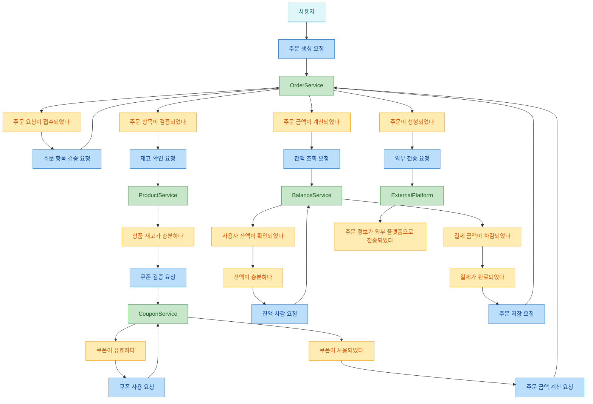

## Step 3 - Mermaid 다이어그램

```mermaid
flowchart TD
    %% 스타일 정의
    classDef actor fill:#E0F7FA,stroke:#00BCD4,color:#006064;
    classDef command fill:#BBDEFB,stroke:#1976D2,color:#0D47A1;
    classDef system fill:#C8E6C9,stroke:#388E3C,color:#1B5E20;
    classDef event fill:#FFECB3,stroke:#FF9800,color:#E65100;

    %% 액터
    A1[사용자]:::actor

    %% 주문 요청
    A1 --> C1[주문 생성 요청]:::command
    C1 --> S1[OrderService]:::system
    S1 --> E1[주문 요청이 접수되었다]:::event
    E1 --> C2[주문 항목 검증 요청]:::command
    C2 --> S1
    S1 --> E2[주문 항목이 검증되었다]:::event

    %% 재고 확인
    E2 --> C3[재고 확인 요청]:::command
    C3 --> S2[ProductService]:::system
    S2 --> E3[상품 재고가 충분하다]:::event

    %% 쿠폰 검증 및 사용
    E3 --> C4[쿠폰 검증 요청]:::command
    C4 --> S3[CouponService]:::system
    S3 --> E4[쿠폰이 유효하다]:::event
    E4 --> C5[쿠폰 사용 요청]:::command
    C5 --> S3
    S3 --> E5[쿠폰이 사용되었다]:::event

    %% 주문 금액 계산
    E5 --> C6[주문 금액 계산 요청]:::command
    C6 --> S1
    S1 --> E6[주문 금액이 계산되었다]:::event

    %% 잔액 확인
    E6 --> C7[잔액 조회 요청]:::command
    C7 --> S4[BalanceService]:::system
    S4 --> E7[사용자 잔액이 확인되었다]:::event
    E7 --> E8[잔액이 충분하다]:::event

    %% 잔액 차감
    E8 --> C8[잔액 차감 요청]:::command
    C8 --> S4
    S4 --> E9[결제 금액이 차감되었다]:::event
    E9 --> E10[결제가 완료되었다]:::event

    %% 주문 저장
    E10 --> C9[주문 저장 요청]:::command
    C9 --> S1
    S1 --> E11[주문이 생성되었다]:::event

    %% 외부 전송
    E11 --> C10[외부 전송 요청]:::command
    C10 --> S5[ExternalPlatform]:::system
    S5 --> E12[주문 정보가 외부 플랫폼으로 전송되었다]:::event

```