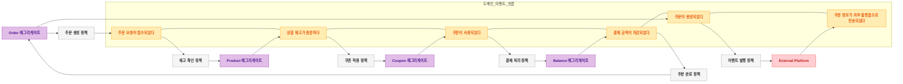

## Step 4 - Aggregate Event Storming

```mermaid
flowchart LR
%% 스타일 정의
    classDef aggregate fill:#E1BEE7,stroke:#9C27B0,color:#4A148C,font-weight:bold;
    classDef command fill:#BBDEFB,stroke:#1976D2,color:#0D47A1,font-weight:bold;
    classDef event fill:#FFECB3,stroke:#FF9800,color:#E65100,font-weight:bold;
    classDef policy fill:#F5F5F5,stroke:#9E9E9E,color:#212121,font-weight:bold;
    classDef external fill:#FFCDD2,stroke:#F44336,color:#B71C1C,font-weight:bold;

%% 애그리게이트 정의
    AG1[Order 애그리게이트]:::aggregate
    AG2[Product 애그리게이트]:::aggregate
    AG3[Coupon 애그리게이트]:::aggregate
    AG4[Balance 애그리게이트]:::aggregate
    EXT[External Platform]:::external

%% 주요 정책
    P1[주문 생성 정책]:::policy
    P2[재고 확인 정책]:::policy
    P3[쿠폰 적용 정책]:::policy
    P4[결제 처리 정책]:::policy
    P5[주문 완료 정책]:::policy
    P6[이벤트 발행 정책]:::policy

%% 핵심 이벤트
    E1[주문 요청이 접수되었다]:::event
    E2[상품 재고가 충분하다]:::event
    E3[쿠폰이 사용되었다]:::event
    E4[결제 금액이 차감되었다]:::event
    E5[주문이 생성되었다]:::event
    E6[주문 정보가 외부 플랫폼으로 전송되었다]:::event

%% 애그리게이트 간 관계
    AG1 --> P1
    P1 --> E1

    E1 --> P2
    P2 --> AG2
    AG2 --> E2

    E2 --> P3
    P3 --> AG3
    AG3 --> E3

    E3 --> P4
    P4 --> AG4
    AG4 --> E4

    E4 --> P5
    P5 --> AG1
    AG1 --> E5

    E5 --> P6
    P6 --> EXT
    EXT --> E6

%% 이벤트 기반 연관관계
    subgraph 도메인_이벤트_흐름
        E1 --- E2
        E2 --- E3
        E3 --- E4
        E4 --- E5
        E5 --- E6
    end
```