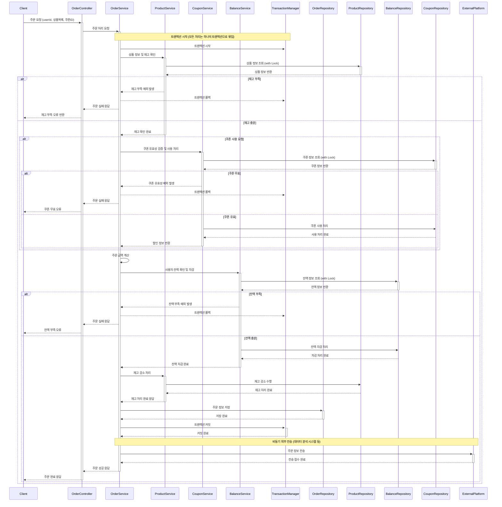

# 시퀀스 다이어그램

> 사용자 → 주문 → 재고 확인 → 쿠폰 → 잔액 차감 → 재고 차감 → 주문 저장 → 외부 전송까지의 전체 흐름

```mermaid
sequenceDiagram
    participant Client
    participant OrderController
    participant OrderService
    participant ProductService
    participant CouponService
    participant BalanceService
    participant TransactionManager
    participant OrderRepository
    participant ProductRepository
    participant BalanceRepository
    participant CouponRepository
    participant ExternalPlatform

%% 주문 요청 진입
    Client->>+OrderController: 주문 요청 (userId, 상품목록, 쿠폰ID)
    OrderController->>+OrderService: 주문 처리 요청

    Note over OrderService,TransactionManager: 트랜잭션 시작 (모든 처리는 하나의 트랜잭션으로 묶임)
    OrderService->>+TransactionManager: 트랜잭션 시작

%% 재고 확인
    OrderService->>+ProductService: 상품 정보 및 재고 확인
    ProductService->>+ProductRepository: 상품 정보 조회 (with Lock)
    ProductRepository-->>-ProductService: 상품 정보 반환

    alt  재고 부족
        ProductService-->>OrderService: 재고 부족 예외 발생
        OrderService-->>TransactionManager: 트랜잭션 롤백
        OrderService-->>OrderController: 주문 실패 응답
        OrderController-->>Client: 재고 부족 오류 반환
    else 재고 충분
        ProductService-->>-OrderService: 재고 확인 완료

    %% 쿠폰 처리
        alt 쿠폰 사용 요청
            OrderService->>+CouponService: 쿠폰 유효성 검증 및 사용 처리
            CouponService->>+CouponRepository: 쿠폰 정보 조회 (with Lock)
            CouponRepository-->>-CouponService: 쿠폰 정보 반환

            alt  쿠폰 무효
                CouponService-->>OrderService: 쿠폰 유효성 예외 발생
                OrderService-->>TransactionManager: 트랜잭션 롤백
                OrderService-->>OrderController: 주문 실패 응답
                OrderController-->>Client: 쿠폰 무효 오류
            else 쿠폰 유효
                CouponService->>CouponRepository: 쿠폰 사용 처리
                CouponRepository-->>CouponService: 사용 처리 완료
                CouponService-->>-OrderService: 할인 정보 반환
            end
        end

    %% 금액 계산
        OrderService->>OrderService: 주문 금액 계산

    %% 잔액 확인 및 차감
        OrderService->>+BalanceService: 사용자 잔액 확인 및 차감
        BalanceService->>+BalanceRepository: 잔액 정보 조회 (with Lock)
        BalanceRepository-->>-BalanceService: 잔액 정보 반환

        alt  잔액 부족
            BalanceService-->>OrderService: 잔액 부족 예외 발생
            OrderService-->>TransactionManager: 트랜잭션 롤백
            OrderService-->>OrderController: 주문 실패 응답
            OrderController-->>Client: 잔액 부족 오류
        else 잔액 충분
            BalanceService->>BalanceRepository: 잔액 차감 처리
            BalanceRepository-->>BalanceService: 차감 처리 완료
            BalanceService-->>-OrderService: 잔액 차감 완료

        %% 재고 차감
            OrderService->>+ProductService: 재고 감소 처리
            ProductService->>ProductRepository: 재고 감소 수행
            ProductRepository-->>ProductService: 재고 처리 완료
            ProductService-->>-OrderService: 재고 처리 완료 응답

        %% 주문 저장
            OrderService->>+OrderRepository: 주문 정보 저장
            OrderRepository-->>-OrderService: 저장 완료

        %% 트랜잭션 커밋
            OrderService->>+TransactionManager: 트랜잭션 커밋
            TransactionManager-->>-OrderService: 커밋 완료

            Note over OrderService,ExternalPlatform: 비동기 외부 전송 (데이터 분석 시스템 등)
            OrderService->>+ExternalPlatform: 주문 정보 전송
            ExternalPlatform-->>-OrderService: 전송 접수 완료

        %% 성공 응답 반환
            OrderService-->>-OrderController: 주문 성공 응답
            OrderController-->>-Client: 주문 완료 응답
        end
    end

```
- 트랜잭션 내에서 재고/잔액/쿠폰 처리를 정확히 하고,
- 예외 발생 시 트랜잭션이 롤백됩니다.
