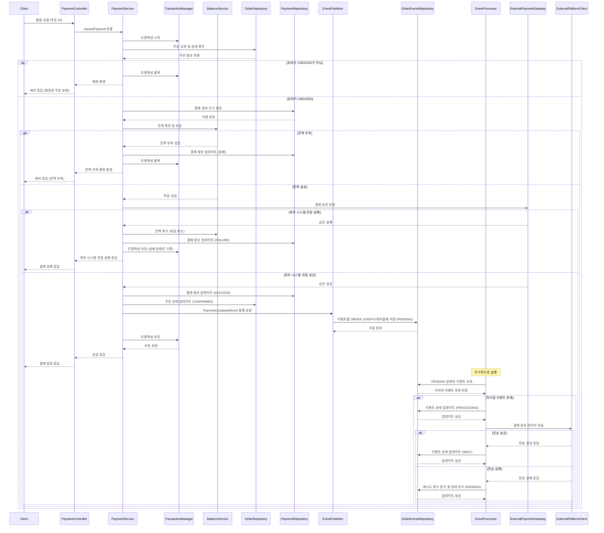

## 결제 요청

```mermaid
sequenceDiagram
    participant Client
    participant PaymentController
    participant PaymentService
    participant TransactionManager
    participant BalanceService
    participant OrderRepository
    participant PaymentRepository
    participant EventPublisher
    participant OrderEventsRepository
    participant EventProcessor
    participant ExternalPaymentGateway
    participant ExternalPlatformClient

    Client->>PaymentController: 결제 요청 (주문 ID)
    PaymentController->>PaymentService: requestPayment 호출

%% 트랜잭션 시작
    PaymentService->>TransactionManager: 트랜잭션 시작

%% 주문 조회 및 상태 확인
    PaymentService->>OrderRepository: 주문 조회 및 상태 확인
    OrderRepository-->>PaymentService: 주문 정보 반환

    alt 상태가 CREATED가 아님
        PaymentService->>TransactionManager: 트랜잭션 롤백
        PaymentService-->>PaymentController: 예외 발생
        PaymentController-->>Client: 에러 응답 (잘못된 주문 상태)
    else 상태가 CREATED
    %% 결제 정보 초기 생성 (INITIATED 상태)
        PaymentService->>PaymentRepository: 결제 정보 초기 생성
        PaymentRepository-->>PaymentService: 저장 완료

    %% 잔액 확인 및 차감
        PaymentService->>BalanceService: 잔액 확인 및 차감

        alt 잔액 부족
            BalanceService-->>PaymentService: 잔액 부족 응답
            PaymentService->>PaymentRepository: 결제 정보 업데이트 (실패)
            PaymentService->>TransactionManager: 트랜잭션 롤백
            PaymentService-->>PaymentController: 잔액 부족 예외 발생
            PaymentController-->>Client: 에러 응답 (잔액 부족)
        else 잔액 충분
            BalanceService-->>PaymentService: 차감 성공

        %% 외부 결제 시스템 연동
            PaymentService->>ExternalPaymentGateway: 결제 승인 요청

            alt 외부 시스템 연동 실패
                ExternalPaymentGateway-->>PaymentService: 승인 실패

            %% 잔액 복구
                PaymentService->>BalanceService: 잔액 복구 (차감 취소)
                PaymentService->>PaymentRepository: 결제 정보 업데이트 (FAILURE)
                PaymentService->>TransactionManager: 트랜잭션 커밋 (실패 상태로 기록)
                PaymentService-->>PaymentController: 외부 시스템 연동 실패 응답
                PaymentController-->>Client: 결제 실패 응답
            else 외부 시스템 연동 성공
                ExternalPaymentGateway-->>PaymentService: 승인 성공

            %% 결제 정보 최종 업데이트
                PaymentService->>PaymentRepository: 결제 정보 업데이트 (SUCCESS)
                PaymentService->>OrderRepository: 주문 상태 업데이트 (CONFIRMED)

            %% 트랜잭셔널 아웃박스 패턴 - 이벤트 저장
                PaymentService->>EventPublisher: PaymentCompletedEvent 발행 요청
                EventPublisher->>OrderEventsRepository: 이벤트를 ORDER_EVENTS 테이블에 저장 (PENDING)
                OrderEventsRepository-->>EventPublisher: 저장 완료

            %% 트랜잭션 커밋 - 결제 정보와 이벤트가 함께 커밋됨
                PaymentService->>TransactionManager: 트랜잭션 커밋
                TransactionManager-->>PaymentService: 커밋 완료

                PaymentService-->>PaymentController: 성공 응답
                PaymentController-->>Client: 결제 완료 응답

            %% --- 비동기 이벤트 처리 (별도 쓰레드/프로세스) ---
                Note over EventProcessor: 주기적으로 실행

                EventProcessor->>OrderEventsRepository: PENDING 상태의 이벤트 조회
                OrderEventsRepository-->>EventProcessor: 미처리 이벤트 목록 반환

                alt 처리할 이벤트 존재
                    EventProcessor->>OrderEventsRepository: 이벤트 상태 업데이트 (PROCESSING)
                    OrderEventsRepository-->>EventProcessor: 업데이트 성공

                %% 데이터 플랫폼으로 결제 완료 데이터 전송
                    EventProcessor->>ExternalPlatformClient: 결제 완료 데이터 전송

                    alt 전송 성공
                        ExternalPlatformClient-->>EventProcessor: 전송 성공 응답
                        EventProcessor->>OrderEventsRepository: 이벤트 상태 업데이트 (SENT)
                        OrderEventsRepository-->>EventProcessor: 업데이트 성공
                    else 전송 실패
                        ExternalPlatformClient-->>EventProcessor: 전송 실패 응답
                        EventProcessor->>OrderEventsRepository: 재시도 횟수 증가 및 상태 유지 (PENDING)
                        OrderEventsRepository-->>EventProcessor: 업데이트 성공
                    end
                end
            end
        end
    end
```