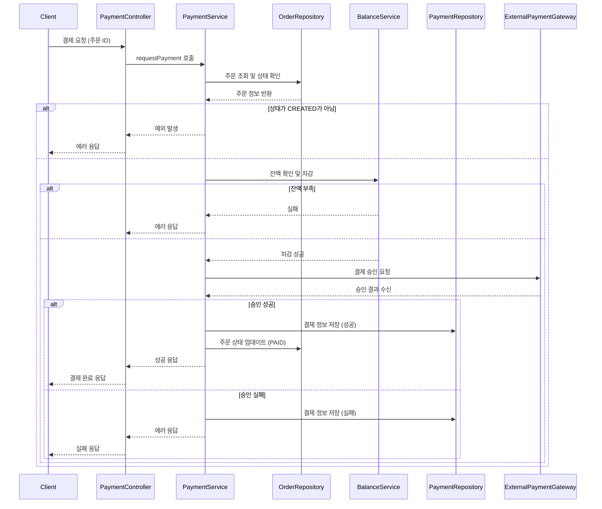

## 결제 요청

```mermaid
sequenceDiagram
    participant Client
    participant PaymentController
    participant PaymentService
    participant OrderRepository
    participant BalanceService
    participant PaymentRepository
    participant ExternalPaymentGateway

    Client->>PaymentController: 결제 요청 (주문 ID)
    PaymentController->>PaymentService: requestPayment 호출

    PaymentService->>OrderRepository: 주문 조회 및 상태 확인
    OrderRepository-->>PaymentService: 주문 정보 반환

    alt 상태가 CREATED가 아님
        PaymentService-->>PaymentController: 예외 발생
        PaymentController-->>Client: 에러 응답
    else
        PaymentService->>BalanceService: 잔액 확인 및 차감
        alt 잔액 부족
            BalanceService-->>PaymentService: 실패
            PaymentService-->>PaymentController: 에러 응답
        else
            BalanceService-->>PaymentService: 차감 성공
            PaymentService->>ExternalPaymentGateway: 결제 승인 요청
            ExternalPaymentGateway-->>PaymentService: 승인 결과 수신

            alt 승인 성공
                PaymentService->>PaymentRepository: 결제 정보 저장 (성공)
                PaymentService->>OrderRepository: 주문 상태 업데이트 (PAID)
                PaymentService-->>PaymentController: 성공 응답
                PaymentController-->>Client: 결제 완료 응답
            else 승인 실패
                PaymentService->>PaymentRepository: 결제 정보 저장 (실패)
                PaymentService-->>PaymentController: 에러 응답
                PaymentController-->>Client: 실패 응답
            end
        end
    end

```