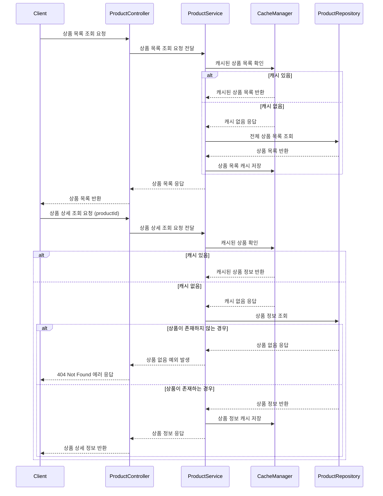

```mermaid
sequenceDiagram
    participant Client
    participant ProductController
    participant ProductService
    participant CacheManager
    participant ProductRepository

    %% 전체 상품 목록 조회
    Client->>ProductController: 상품 목록 조회 요청
    ProductController->>ProductService: 상품 목록 조회 요청 전달
    
    %% 캐시 확인
    ProductService->>CacheManager: 캐시된 상품 목록 확인
    
    alt 캐시 있음
        CacheManager-->>ProductService: 캐시된 상품 목록 반환
    else 캐시 없음
        CacheManager-->>ProductService: 캐시 없음 응답
        ProductService->>ProductRepository: 전체 상품 목록 조회
        ProductRepository-->>ProductService: 상품 목록 반환
        ProductService->>CacheManager: 상품 목록 캐시 저장
    end
    
    ProductService-->>ProductController: 상품 목록 응답
    ProductController-->>Client: 상품 목록 반환
    
    %% 단일 상품 상세 조회
    Client->>ProductController: 상품 상세 조회 요청 (productId)
    ProductController->>ProductService: 상품 상세 조회 요청 전달
    
    %% 캐시 확인
    ProductService->>CacheManager: 캐시된 상품 확인
    
    alt 캐시 있음
        CacheManager-->>ProductService: 캐시된 상품 정보 반환
    else 캐시 없음
        CacheManager-->>ProductService: 캐시 없음 응답
        ProductService->>ProductRepository: 상품 정보 조회
        
        alt 상품이 존재하지 않는 경우
            ProductRepository-->>ProductService: 상품 없음 응답
            ProductService-->>ProductController: 상품 없음 예외 발생
            ProductController-->>Client: 404 Not Found 에러 응답
        else 상품이 존재하는 경우
            ProductRepository-->>ProductService: 상품 정보 반환
            ProductService->>CacheManager: 상품 정보 캐시 저장
            ProductService-->>ProductController: 상품 정보 응답
            ProductController-->>Client: 상품 상세 정보 반환
        end
    end
```