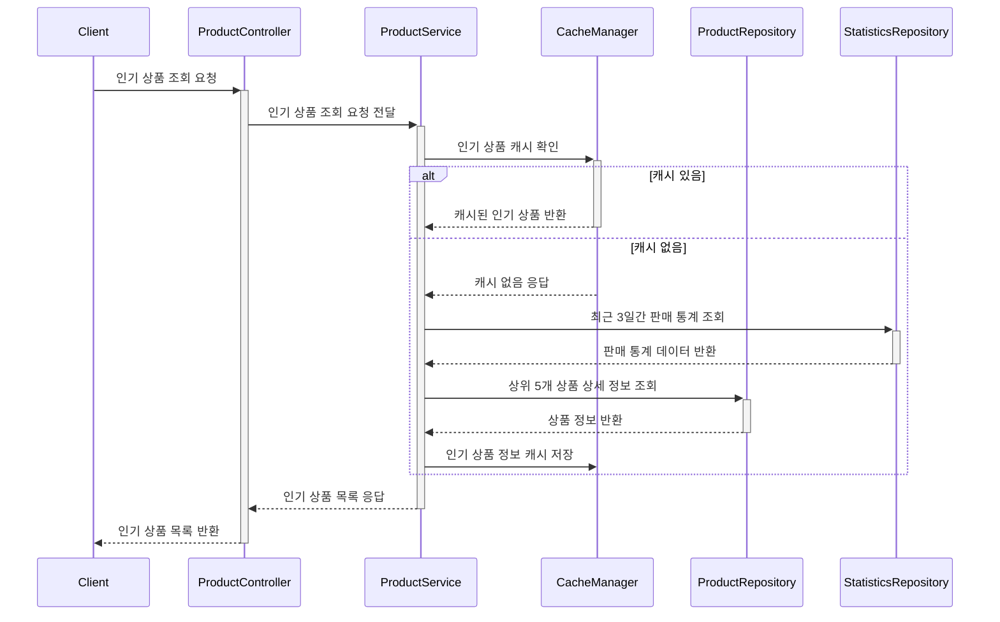

## 인기 상품 조회 프로세스

```mermaid
    sequenceDiagram
    participant Client
    participant ProductController
    participant ProductService
    participant CacheManager
    participant ProductRepository
    participant StatisticsRepository

%% 인기 상품 조회 프로세스
    Client->>+ProductController: 인기 상품 조회 요청
    ProductController->>+ProductService: 인기 상품 조회 요청 전달

%% 캐시 확인
    ProductService->>+CacheManager: 인기 상품 캐시 확인

    alt 캐시 있음
        CacheManager-->>-ProductService: 캐시된 인기 상품 반환
    else 캐시 없음
        CacheManager-->>ProductService: 캐시 없음 응답

    %% 최근 3일 판매 데이터 집계
        ProductService->>+StatisticsRepository: 최근 3일간 판매 통계 조회
        StatisticsRepository-->>-ProductService: 판매 통계 데이터 반환

    %% 상품 정보 조회
        ProductService->>+ProductRepository: 상위 5개 상품 상세 정보 조회
        ProductRepository-->>-ProductService: 상품 정보 반환

    %% 결과 캐싱
        ProductService->>CacheManager: 인기 상품 정보 캐시 저장
    end

    ProductService-->>-ProductController: 인기 상품 목록 응답
    ProductController-->>-Client: 인기 상품 목록 반환
```