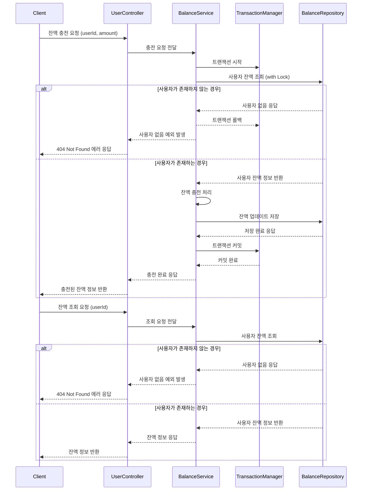

## 잔액 충전 및 조회 프로세스

```mermaid
sequenceDiagram
    participant Client
    participant UserController
    participant BalanceService
    participant TransactionManager
    participant BalanceRepository

%% 잔액 충전 프로세스
    Client->>UserController: 잔액 충전 요청 (userId, amount)
    UserController->>BalanceService: 충전 요청 전달
    BalanceService->>TransactionManager: 트랜잭션 시작
    BalanceService->>BalanceRepository: 사용자 잔액 조회 (with Lock)

    alt 사용자가 존재하지 않는 경우
        BalanceRepository-->>BalanceService: 사용자 없음 응답
        BalanceService-->>TransactionManager: 트랜잭션 롤백
        BalanceService-->>UserController: 사용자 없음 예외 발생
        UserController-->>Client: 404 Not Found 에러 응답
    else 사용자가 존재하는 경우
        BalanceRepository-->>BalanceService: 사용자 잔액 정보 반환
        BalanceService->>BalanceService: 잔액 충전 처리
        BalanceService->>BalanceRepository: 잔액 업데이트 저장
        BalanceRepository-->>BalanceService: 저장 완료 응답
        BalanceService->>TransactionManager: 트랜잭션 커밋
        TransactionManager-->>BalanceService: 커밋 완료
        BalanceService-->>UserController: 충전 완료 응답
        UserController-->>Client: 충전된 잔액 정보 반환
    end

%% 잔액 조회 프로세스
    Client->>UserController: 잔액 조회 요청 (userId)
    UserController->>BalanceService: 조회 요청 전달
    BalanceService->>BalanceRepository: 사용자 잔액 조회

    alt 사용자가 존재하지 않는 경우
        BalanceRepository-->>BalanceService: 사용자 없음 응답
        BalanceService-->>UserController: 사용자 없음 예외 발생
        UserController-->>Client: 404 Not Found 에러 응답
    else 사용자가 존재하는 경우
        BalanceRepository-->>BalanceService: 사용자 잔액 정보 반환
        BalanceService-->>UserController: 잔액 정보 응답
        UserController-->>Client: 잔액 정보 반환
    end
```