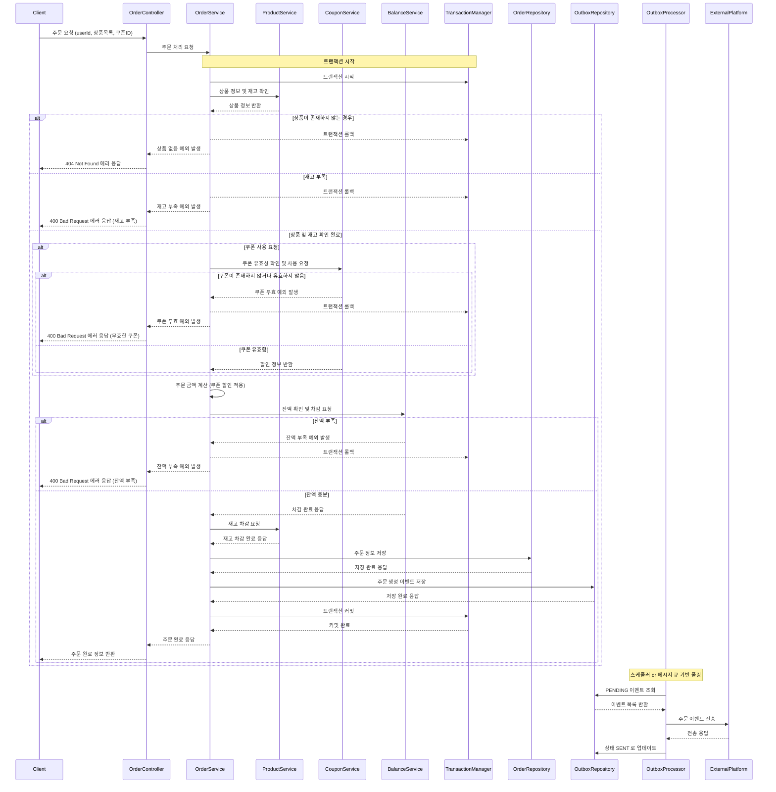

```mermaid
sequenceDiagram
    participant Client
    participant OrderController
    participant OrderService
    participant ProductService
    participant CouponService
    participant BalanceService
    participant TransactionManager
    participant OrderRepository
    participant OutboxRepository
    participant OutboxProcessor
    participant ExternalPlatform

    Client->>OrderController: 주문 요청 (userId, 상품목록, 쿠폰ID)
    OrderController->>OrderService: 주문 처리 요청
    
    Note over OrderService,TransactionManager: 트랜잭션 시작
    OrderService->>TransactionManager: 트랜잭션 시작

    %% 상품 정보 및 재고 확인
    OrderService->>ProductService: 상품 정보 및 재고 확인
    ProductService-->>OrderService: 상품 정보 반환

    alt 상품이 존재하지 않는 경우
        OrderService-->>TransactionManager: 트랜잭션 롤백
        OrderService-->>OrderController: 상품 없음 예외 발생
        OrderController-->>Client: 404 Not Found 에러 응답
    else 재고 부족
        OrderService-->>TransactionManager: 트랜잭션 롤백
        OrderService-->>OrderController: 재고 부족 예외 발생
        OrderController-->>Client: 400 Bad Request 에러 응답 (재고 부족)
    else 상품 및 재고 확인 완료
        %% 쿠폰 적용 (선택적)
        alt 쿠폰 사용 요청
            OrderService->>CouponService: 쿠폰 유효성 확인 및 사용 요청

            alt 쿠폰이 존재하지 않거나 유효하지 않음
                CouponService-->>OrderService: 쿠폰 무효 예외 발생
                OrderService-->>TransactionManager: 트랜잭션 롤백
                OrderService-->>OrderController: 쿠폰 무효 예외 발생
                OrderController-->>Client: 400 Bad Request 에러 응답 (무효한 쿠폰)
            else 쿠폰 유효함
                CouponService-->>OrderService: 할인 정보 반환
            end
        end

        %% 주문 금액 계산
        OrderService->>OrderService: 주문 금액 계산 (쿠폰 할인 적용)

        %% 잔액 확인 및 차감
        OrderService->>BalanceService: 잔액 확인 및 차감 요청

        alt 잔액 부족
            BalanceService-->>OrderService: 잔액 부족 예외 발생
            OrderService-->>TransactionManager: 트랜잭션 롤백
            OrderService-->>OrderController: 잔액 부족 예외 발생
            OrderController-->>Client: 400 Bad Request 에러 응답 (잔액 부족)
        else 잔액 충분
            BalanceService-->>OrderService: 차감 완료 응답

            %% 재고 차감
            OrderService->>ProductService: 재고 차감 요청
            ProductService-->>OrderService: 재고 차감 완료 응답

            %% 주문 정보 저장
            OrderService->>OrderRepository: 주문 정보 저장
            OrderRepository-->>OrderService: 저장 완료 응답

            %% Outbox 이벤트 저장
            OrderService->>OutboxRepository: 주문 생성 이벤트 저장
            OutboxRepository-->>OrderService: 저장 완료 응답

            %% 트랜잭션 커밋
            OrderService->>TransactionManager: 트랜잭션 커밋
            TransactionManager-->>OrderService: 커밋 완료

            OrderService-->>OrderController: 주문 완료 응답
            OrderController-->>Client: 주문 완료 정보 반환
        end
    end

    %% 비동기 이벤트 처리 (Outbox Processor 별도 스레드/모듈에서 수행)
    Note over OutboxProcessor: 스케줄러 or 메시지 큐 기반 폴링
    OutboxProcessor->>OutboxRepository: PENDING 이벤트 조회
    OutboxRepository-->>OutboxProcessor: 이벤트 목록 반환
    OutboxProcessor->>ExternalPlatform: 주문 이벤트 전송
    ExternalPlatform-->>OutboxProcessor: 전송 응답
    OutboxProcessor->>OutboxRepository: 상태 SENT 로 업데이트

```