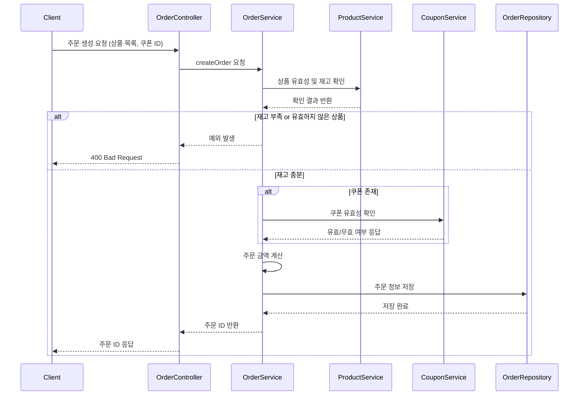

## 주문 생성 시나리오

```mermaid
sequenceDiagram
    participant Client
    participant OrderController
    participant OrderService
    participant ProductService
    participant CouponService
    participant OrderRepository

    Client->>OrderController: 주문 생성 요청 (상품 목록, 쿠폰 ID)
    OrderController->>OrderService: createOrder 요청

    OrderService->>ProductService: 상품 유효성 및 재고 확인
    ProductService-->>OrderService: 확인 결과 반환

    alt 재고 부족 or 유효하지 않은 상품
        OrderService-->>OrderController: 예외 발생
        OrderController-->>Client: 400 Bad Request
    else 재고 충분
        alt 쿠폰 존재
            OrderService->>CouponService: 쿠폰 유효성 확인
            CouponService-->>OrderService: 유효/무효 여부 응답
        end

        OrderService->>OrderService: 주문 금액 계산
        OrderService->>OrderRepository: 주문 정보 저장
        OrderRepository-->>OrderService: 저장 완료
        OrderService-->>OrderController: 주문 ID 반환
        OrderController-->>Client: 주문 ID 응답
    end

```