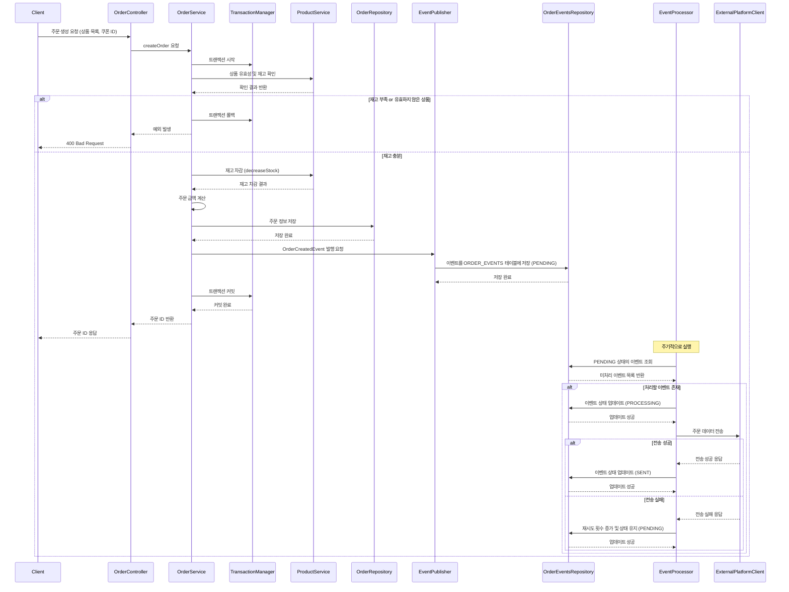

## 주문 생성 시나리오

```mermaid
sequenceDiagram
    participant Client
    participant OrderController
    participant OrderService
    participant TransactionManager
    participant ProductService
    participant OrderRepository
    participant EventPublisher
    participant OrderEventsRepository
    participant EventProcessor
    participant ExternalPlatformClient

    Client->>OrderController: 주문 생성 요청 (상품 목록, 쿠폰 ID)
    OrderController->>OrderService: createOrder 요청

%% 트랜잭션 시작
    OrderService->>TransactionManager: 트랜잭션 시작

%% 상품 유효성 및 재고 확인
    OrderService->>ProductService: 상품 유효성 및 재고 확인
    ProductService-->>OrderService: 확인 결과 반환

    alt 재고 부족 or 유효하지 않은 상품
        OrderService->>TransactionManager: 트랜잭션 롤백
        OrderService-->>OrderController: 예외 발생
        OrderController-->>Client: 400 Bad Request
    else 재고 충분
    %% 재고 차감
        OrderService->>ProductService: 재고 차감 (decreaseStock)
        ProductService-->>OrderService: 재고 차감 결과

    %% 주문 생성 및 저장
        OrderService->>OrderService: 주문 금액 계산
        OrderService->>OrderRepository: 주문 정보 저장
        OrderRepository-->>OrderService: 저장 완료

    %% 트랜잭셔널 아웃박스 패턴 - 이벤트 저장
        OrderService->>EventPublisher: OrderCreatedEvent 발행 요청
        EventPublisher->>OrderEventsRepository: 이벤트를 ORDER_EVENTS 테이블에 저장 (PENDING)
        OrderEventsRepository-->>EventPublisher: 저장 완료

    %% 트랜잭션 커밋 - 주문 정보와 이벤트가 함께 커밋됨
        OrderService->>TransactionManager: 트랜잭션 커밋
        TransactionManager-->>OrderService: 커밋 완료

        OrderService-->>OrderController: 주문 ID 반환
        OrderController-->>Client: 주문 ID 응답

    %% --- 비동기 이벤트 처리 (별도 쓰레드/프로세스) ---
        Note over EventProcessor: 주기적으로 실행

        EventProcessor->>OrderEventsRepository: PENDING 상태의 이벤트 조회
        OrderEventsRepository-->>EventProcessor: 미처리 이벤트 목록 반환

        alt 처리할 이벤트 존재
            EventProcessor->>OrderEventsRepository: 이벤트 상태 업데이트 (PROCESSING)
            OrderEventsRepository-->>EventProcessor: 업데이트 성공

            EventProcessor->>ExternalPlatformClient: 주문 데이터 전송

            alt 전송 성공
                ExternalPlatformClient-->>EventProcessor: 전송 성공 응답
                EventProcessor->>OrderEventsRepository: 이벤트 상태 업데이트 (SENT)
                OrderEventsRepository-->>EventProcessor: 업데이트 성공
            else 전송 실패
                ExternalPlatformClient-->>EventProcessor: 전송 실패 응답
                EventProcessor->>OrderEventsRepository: 재시도 횟수 증가 및 상태 유지 (PENDING)
                OrderEventsRepository-->>EventProcessor: 업데이트 성공
            end
        end
    end
```