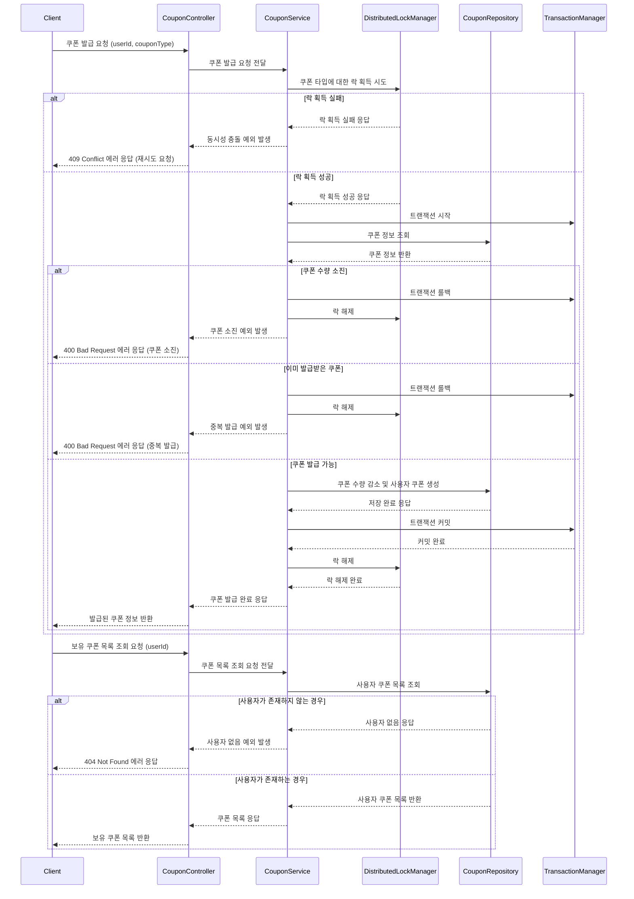

```mermaid
sequenceDiagram
    participant Client
    participant CouponController
    participant CouponService
    participant DistributedLockManager
    participant CouponRepository
    participant TransactionManager

    %% 선착순 쿠폰 발급 프로세스
    Client->>CouponController: 쿠폰 발급 요청 (userId, couponType)
    CouponController->>CouponService: 쿠폰 발급 요청 전달
    
    %% 분산 락 획득 시도
    CouponService->>DistributedLockManager: 쿠폰 타입에 대한 락 획득 시도
    
    alt 락 획득 실패
        DistributedLockManager-->>CouponService: 락 획득 실패 응답
        CouponService-->>CouponController: 동시성 충돌 예외 발생
        CouponController-->>Client: 409 Conflict 에러 응답 (재시도 요청)
    else 락 획득 성공
        DistributedLockManager-->>CouponService: 락 획득 성공 응답
        
        %% 트랜잭션 시작
        CouponService->>TransactionManager: 트랜잭션 시작
        
        %% 쿠폰 정보 조회
        CouponService->>CouponRepository: 쿠폰 정보 조회
        CouponRepository-->>CouponService: 쿠폰 정보 반환
        
        %% 쿠폰 발급 가능 여부 확인
        alt 쿠폰 수량 소진
            CouponService->>TransactionManager: 트랜잭션 롤백
            CouponService->>DistributedLockManager: 락 해제
            CouponService-->>CouponController: 쿠폰 소진 예외 발생
            CouponController-->>Client: 400 Bad Request 에러 응답 (쿠폰 소진)
        else 이미 발급받은 쿠폰
            CouponService->>TransactionManager: 트랜잭션 롤백
            CouponService->>DistributedLockManager: 락 해제
            CouponService-->>CouponController: 중복 발급 예외 발생
            CouponController-->>Client: 400 Bad Request 에러 응답 (중복 발급)
        else 쿠폰 발급 가능
            %% 쿠폰 남은 수량 감소 및 사용자 쿠폰 발급
            CouponService->>CouponRepository: 쿠폰 수량 감소 및 사용자 쿠폰 생성
            CouponRepository-->>CouponService: 저장 완료 응답
            
            %% 트랜잭션 커밋
            CouponService->>TransactionManager: 트랜잭션 커밋
            TransactionManager-->>CouponService: 커밋 완료
            
            %% 락 해제
            CouponService->>DistributedLockManager: 락 해제
            DistributedLockManager-->>CouponService: 락 해제 완료
            
            CouponService-->>CouponController: 쿠폰 발급 완료 응답
            CouponController-->>Client: 발급된 쿠폰 정보 반환
        end
    end
    
    %% 보유 쿠폰 목록 조회 프로세스
    Client->>CouponController: 보유 쿠폰 목록 조회 요청 (userId)
    CouponController->>CouponService: 쿠폰 목록 조회 요청 전달
    CouponService->>CouponRepository: 사용자 쿠폰 목록 조회
    
    alt 사용자가 존재하지 않는 경우
        CouponRepository-->>CouponService: 사용자 없음 응답
        CouponService-->>CouponController: 사용자 없음 예외 발생
        CouponController-->>Client: 404 Not Found 에러 응답
    else 사용자가 존재하는 경우
        CouponRepository-->>CouponService: 사용자 쿠폰 목록 반환
        CouponService-->>CouponController: 쿠폰 목록 응답
        CouponController-->>Client: 보유 쿠폰 목록 반환
    end
```