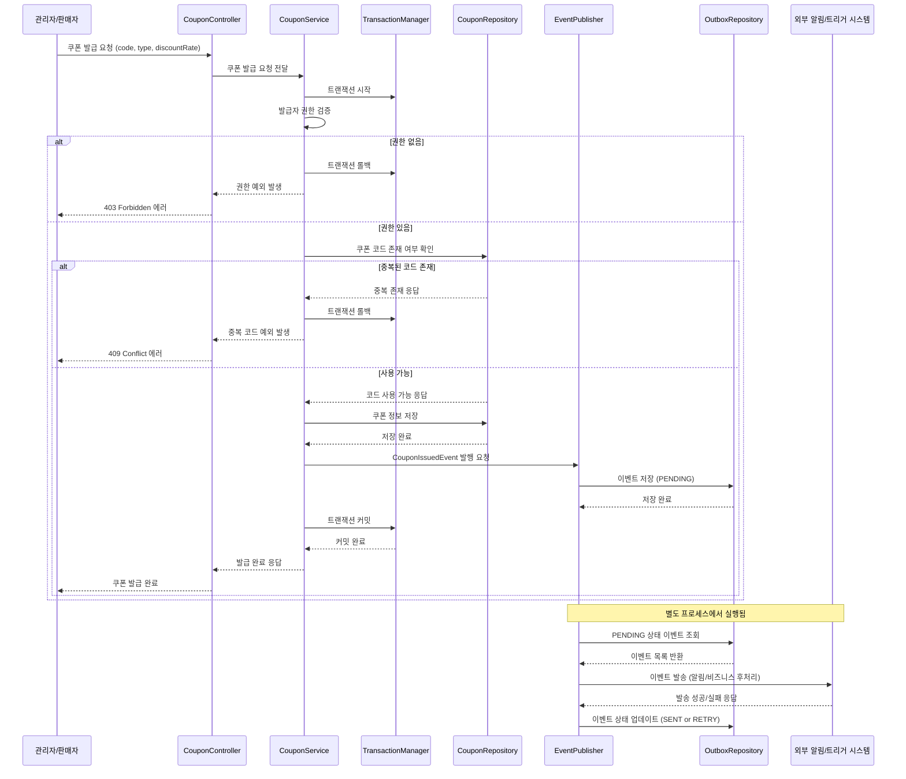

## 쿠폰 발급 및 조회 시나리오

```mermaid
sequenceDiagram
    participant AdminOrSeller as 관리자/판매자
    participant CouponController
    participant CouponService
    participant TransactionManager
    participant CouponRepository
    participant EventPublisher
    participant OutboxRepository
    participant ExternalTriggerSystem as 외부 알림/트리거 시스템

%% 쿠폰 발급 요청
    AdminOrSeller->>CouponController: 쿠폰 발급 요청 (code, type, discountRate)
    CouponController->>CouponService: 쿠폰 발급 요청 전달

%% 트랜잭션 시작
    CouponService->>TransactionManager: 트랜잭션 시작

%% 발급자 권한 검증
    CouponService->>CouponService: 발급자 권한 검증
    alt 권한 없음
        CouponService->>TransactionManager: 트랜잭션 롤백
        CouponService-->>CouponController: 권한 예외 발생
        CouponController-->>AdminOrSeller: 403 Forbidden 에러
    else 권한 있음

    %% 쿠폰 코드 중복 여부 확인
        CouponService->>CouponRepository: 쿠폰 코드 존재 여부 확인
        alt 중복된 코드 존재
            CouponRepository-->>CouponService: 중복 존재 응답
            CouponService->>TransactionManager: 트랜잭션 롤백
            CouponService-->>CouponController: 중복 코드 예외 발생
            CouponController-->>AdminOrSeller: 409 Conflict 에러
        else 사용 가능
            CouponRepository-->>CouponService: 코드 사용 가능 응답

        %% 쿠폰 생성 및 저장
            CouponService->>CouponRepository: 쿠폰 정보 저장
            CouponRepository-->>CouponService: 저장 완료

        %% 쿠폰 발급 이벤트 저장 (Outbox)
            CouponService->>EventPublisher: CouponIssuedEvent 발행 요청
            EventPublisher->>OutboxRepository: 이벤트 저장 (PENDING)
            OutboxRepository-->>EventPublisher: 저장 완료

        %% 트랜잭션 커밋
            CouponService->>TransactionManager: 트랜잭션 커밋
            TransactionManager-->>CouponService: 커밋 완료

            CouponService-->>CouponController: 발급 완료 응답
            CouponController-->>AdminOrSeller: 쿠폰 발급 완료
        end
    end

%% --- 비동기 이벤트 발행 ---
    Note over EventPublisher, ExternalTriggerSystem: 별도 프로세스에서 실행됨

    EventPublisher->>OutboxRepository: PENDING 상태 이벤트 조회
    OutboxRepository-->>EventPublisher: 이벤트 목록 반환

    EventPublisher->>ExternalTriggerSystem: 이벤트 발송 (알림/비즈니스 후처리)
    ExternalTriggerSystem-->>EventPublisher: 발송 성공/실패 응답

    EventPublisher->>OutboxRepository: 이벤트 상태 업데이트 (SENT or RETRY)

```