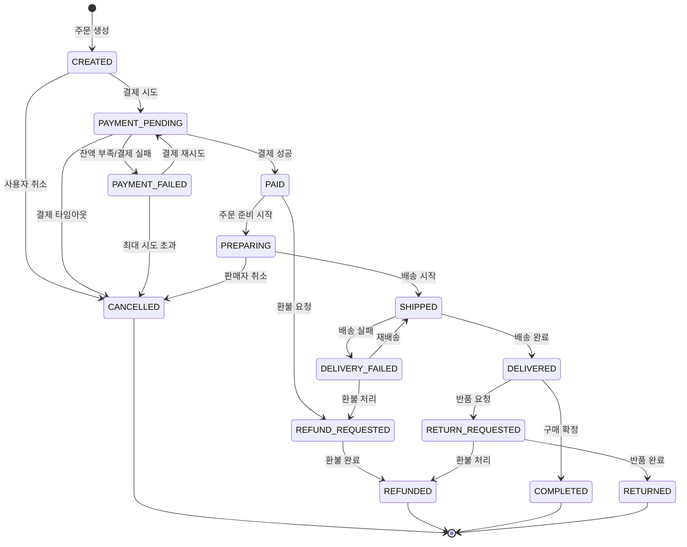

```mermaid
stateDiagram-v2
    [*] --> CREATED: 주문 생성
    
    CREATED --> PAYMENT_PENDING: 결제 시도
    CREATED --> CANCELLED: 사용자 취소
    
    PAYMENT_PENDING --> PAID: 결제 성공
    PAYMENT_PENDING --> PAYMENT_FAILED: 잔액 부족/결제 실패
    PAYMENT_PENDING --> CANCELLED: 결제 타임아웃
    
    PAYMENT_FAILED --> PAYMENT_PENDING: 결제 재시도
    PAYMENT_FAILED --> CANCELLED: 최대 시도 초과
    
    PAID --> PREPARING: 주문 준비 시작
    PAID --> REFUND_REQUESTED: 환불 요청
    
    PREPARING --> SHIPPED: 배송 시작
    PREPARING --> CANCELLED: 판매자 취소
    
    SHIPPED --> DELIVERED: 배송 완료
    SHIPPED --> DELIVERY_FAILED: 배송 실패
    
    DELIVERY_FAILED --> SHIPPED: 재배송
    DELIVERY_FAILED --> REFUND_REQUESTED: 환불 처리
    
    REFUND_REQUESTED --> REFUNDED: 환불 완료
    
    DELIVERED --> COMPLETED: 구매 확정
    DELIVERED --> RETURN_REQUESTED: 반품 요청
    
    RETURN_REQUESTED --> RETURNED: 반품 완료
    RETURN_REQUESTED --> REFUNDED: 환불 처리
    
    CANCELLED --> [*]
    REFUNDED --> [*]
    COMPLETED --> [*]
    RETURNED --> [*]
```