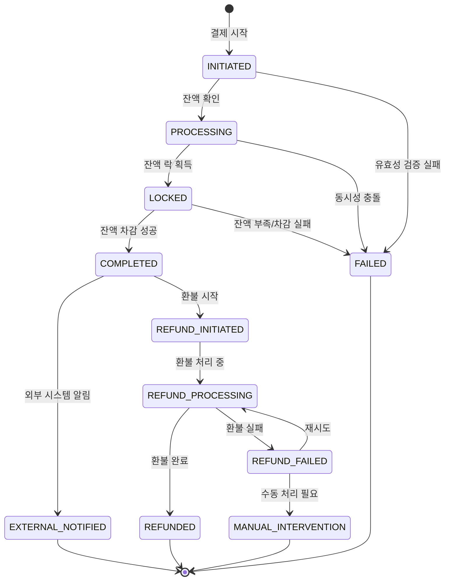

```mermaid
stateDiagram-v2
    [*] --> INITIATED: 결제 시작
    
    INITIATED --> PROCESSING: 잔액 확인
    INITIATED --> FAILED: 유효성 검증 실패
    
    PROCESSING --> LOCKED: 잔액 락 획득
    PROCESSING --> FAILED: 동시성 충돌
    
    LOCKED --> COMPLETED: 잔액 차감 성공
    LOCKED --> FAILED: 잔액 부족/차감 실패
    
    COMPLETED --> EXTERNAL_NOTIFIED: 외부 시스템 알림
    COMPLETED --> REFUND_INITIATED: 환불 시작
    
    EXTERNAL_NOTIFIED --> [*]
    
    REFUND_INITIATED --> REFUND_PROCESSING: 환불 처리 중
    REFUND_PROCESSING --> REFUNDED: 환불 완료
    REFUND_PROCESSING --> REFUND_FAILED: 환불 실패
    
    REFUND_FAILED --> REFUND_PROCESSING: 재시도
    REFUND_FAILED --> MANUAL_INTERVENTION: 수동 처리 필요
    
    REFUNDED --> [*]
    FAILED --> [*]
    MANUAL_INTERVENTION --> [*]
```