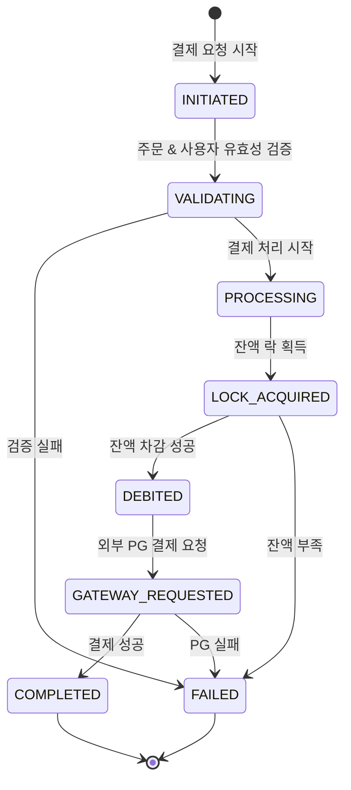

```mermaid
stateDiagram-v2
    [*] --> INITIATED: 결제 요청 시작

    INITIATED --> VALIDATING: 주문 & 사용자 유효성 검증
    VALIDATING --> FAILED: 검증 실패
    VALIDATING --> PROCESSING: 결제 처리 시작

    PROCESSING --> LOCK_ACQUIRED: 잔액 락 획득
    LOCK_ACQUIRED --> DEBITED: 잔액 차감 성공
    LOCK_ACQUIRED --> FAILED: 잔액 부족

    DEBITED --> GATEWAY_REQUESTED: 외부 PG 결제 요청
    GATEWAY_REQUESTED --> COMPLETED: 결제 성공
    GATEWAY_REQUESTED --> FAILED: PG 실패

    COMPLETED --> [*]
    FAILED --> [*]

```